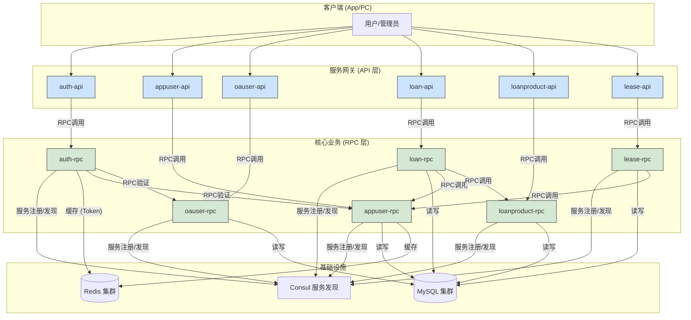
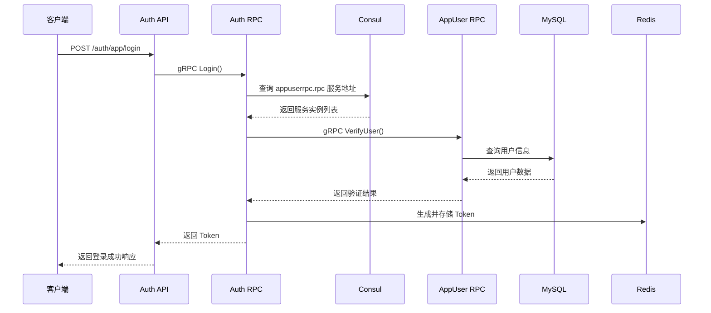
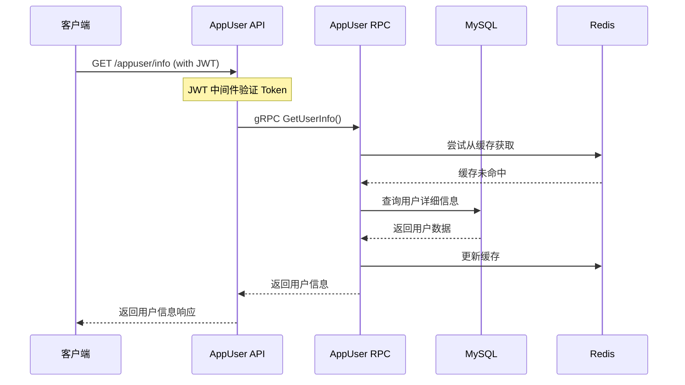

# 惠农金服 - 微服务关系与接口设计

## 1. 概述

本文档旨在清晰地定义惠农金服项目中各个微服务的功能边界、核心职责、对外（API）与对内（RPC）的接口，以及服务之间的调用关系。它是 `微服务架构设计.md` 的实践补充，帮助开发人员快速理解系统全貌。

## 2. 总体架构图

下图描绘了系统核心服务之间的交互关系。所有外部请求都通过各服务的 `API` 层（网关）进入，`API` 层再通过 `RPC` 调用相应的业务逻辑服务。服务之间通过 `Consul` 进行服务发现和调用。



## 3. 服务拆解与接口定义

### 3.1 Auth 服务 (统一认证中心)

*   **核心职责**: 作为系统**唯一**的认证授权中心，处理C端用户(`appuser`)和B端用户(`oauser`)的登录请求，生成、校验、刷新JWT Token，并管理Token的生命周期（如黑名单）。
*   **主要依赖**: Redis, Consul。
*   **对外 API 接口 (`auth-api`)**:
    *   `POST /app/login`: C端用户登录。
    *   `POST /oa/login`: B端(后台)用户登录。
    *   `POST /refresh_token`: 使用refresh_token续签访问令牌。
    *   `POST /logout`: 用户登出（将当前Token加入黑名单）。
*   **对内 RPC 接口 (`auth-rpc`)**:
    *   `GenerateToken`: 根据用户ID、用户类型、角色等信息生成Token。
    *   `ValidateToken`: 解析并校验Token，返回包含的用户信息。
    *   `BlacklistToken`: 将一个Token拉入黑名单，使其失效。
*   **调用关系**:
    *   **被调用**: 被所有需要登录的客户端调用。被各个业务API服务的网关中间件调用，进行统一的请求鉴权。
    *   **调用**: 登录时，会调用 `appuser-rpc` 或 `oauser-rpc` 的接口来验证用户的账号和密码是否正确。

### 3.2 AppUser 服务 (C端用户服务)

*   **核心职责**: 严格管理**C端(App)用户**的核心信息。包括用户的个人资料、账户状态、信用评分、风险评估记录以及用户提交的各类认证材料（身份、银行卡等）。是所有面向终端用户业务（如贷款、租赁）的用户数据基石。
*   **主要依赖**: MySQL, Redis, Consul。
*   **对外 API 接口 (`appuser-api`)**:
    *   `POST /register`: 用户注册。
    *   `GET /info`: 获取当前已登录用户的个人信息。
    *   `PUT /profile`: 更新个人资料。
    *   `POST /verifications`: 提交认证信息（如身份证）。
    *   `GET /credit-score`: 获取个人信用分。
    *   `POST /assess-risk`: 提交风险评估请求。
*   **对内 RPC 接口 (`appuser-rpc`)**:
    *   `GetUserByAccount`: 根据账号（手机号）查询用户是否存在。
    *   `VerifyUserPassword`: 验证用户密码是否正确。
    *   `CreateUser`: 创建新用户。
    *   `GetUserInfo`: 根据用户ID获取用户基础信息。
    *   `GetUserCreditScore`: 获取用户最新的信用评分。
    *   `AssessRisk`: 对用户进行风险评估。
*   **调用关系**:
    *   **被调用**: 被 `auth-rpc` 调用以验证用户凭据；被 `loan-rpc`、`lease-rpc` 等业务服务调用，用于获取用户档案、信用等业务所需信息。
    *   **调用**: 不主动调用其他业务RPC服务。

### 3.3 OAUser 服务 (B端后台用户服务)

*   **核心职责**: 严格管理**B端(后台)**的所有用户信息、角色和权限。用户分为**管理员**、**普通职员**等不同角色，拥有不同的操作权限。
*   **主要依赖**: MySQL, Consul。
*   **对外 API 接口 (`oauser-api`)**:
    *   `GET /admin/users`: (需权限) 分页获取后台用户列表。
    *   `POST /admin/users`: (需权限) 创建后台用户（管理员或职员）。
    *   `PUT /admin/users/:id/status`: (需权限) 更新后台用户状态（启用/禁用）。
    *   `GET /admin/roles`: (需权限) 获取所有角色列表。
    *   `POST /admin/permissions`: (需权限) 创建新的权限点。
*   **对内 RPC 接口 (`oauser-rpc`)**:
    *   `GetOAUserByUsername`: 根据用户名查询后台用户。
    *   `VerifyOAPassword`: 验证后台用户的密码。
    *   `GetOAUserList`: 分页获取后台用户列表。
    *   `CheckPermission`: 检查指定用户ID是否拥有某个权限。
*   **调用关系**:
    *   **被调用**: 被 `auth-rpc` 调用以验证后台用户凭据；被需要进行后台操作权限校验的业务服务中间件调用。
    *   **调用**: 暂无。

### 3.4 Loan 服务

*   **核心职责**: 处理用户贷款申请、审批流程、放款和还款管理。
*   **主要依赖**: MySQL, Redis, Consul。
*   **对外 API 接口 (`loan-api`)**:
    *   `POST /loans/apply`: 提交贷款申请
    *   `GET /loans`: 查看我的贷款列表
    *   `GET /loans/:id`: 查看贷款详情
    *   `POST /repayment`: 进行还款
    *   `GET /admin/loans`: (管理员) 贷款审批列表
*   **对内 RPC 接口 (`loan-rpc`)**:
    *   `CreateLoanApplication`: 创建贷款申请
    *   `ApproveLoan`: 审批贷款
    *   `GetLoanList`: 获取贷款列表
*   **调用关系**:
    *   **被调用**: 暂无。
    *   **调用**: 调用 `AppUser-RPC` 获取申请人信息；调用 `LoanProduct-RPC` 获取贷款产品信息。

### 3.5 LoanProduct 服务

*   **核心职责**: 管理贷款产品，包括利率、期限、额度、准入条件等。
*   **主要依赖**: MySQL, Consul。
*   **对外 API 接口 (`loanproduct-api`)**:
    *   `GET /products`: 获取贷款产品列表
    *   `GET /products/:id`: 获取产品详情
    *   `POST /admin/products`: (管理员) 创建贷款产品
*   **对内 RPC 接口 (`loanproduct-rpc`)**:
    *   `GetProductById`: 根据ID获取产品信息
    *   `CheckEligibility`: 检查用户是否符合产品准入条件
*   **调用关系**:
    *   **被调用**: 被 `Loan-RPC` 调用。
    *   **调用**: 不主动调用其他业务RPC服务。

### 3.6 Lease 服务

*   **核心职责**: 处理农机、土地等资产的租赁申请、合同管理和租金支付。
*   **主要依赖**: MySQL, Consul。
*   **对外 API 接口 (`lease-api`)**:
    *   `POST /leases/apply`: 提交租赁申请
    *   `GET /leases`: 查看我的租赁列表
    *   `GET /admin/leases`: (管理员) 租赁审批列表
*   **对内 RPC 接口 (`lease-rpc`)**:
    *   `CreateLeaseApplication`: 创建租赁申请
    *   `GetLeaseContract`: 获取租赁合同
*   **调用关系**:
    *   **被调用**: 暂无。
    *   **调用**: 调用 `AppUser-RPC` 获取申请人信息。

## 6. 服务间调用的实现细节与最佳实践

> **重要说明**：本章节详细说明了服务间正确的调用方式，总结了常见的架构误区，确保团队开发时遵循正确的微服务原则。

### 6.1 服务调用的三层原则

#### 层次1：客户端 → API 层
- **调用方式**：HTTP/HTTPS 请求
- **认证方式**：JWT Token (由 Auth 服务签发)
- **负载均衡**：通过 API 网关或 Nginx 实现
- **示例**：
  ```bash
  # 用户登录
  POST http://api.huinong.com/auth/app/login
  
  # 获取用户信息 (需要 JWT)
  GET http://api.huinong.com/appuser/info
  Authorization: Bearer <jwt_token>
  ```

#### 层次2：API → 自己的 RPC
- **调用方式**：本地 gRPC 调用
- **原则**：API 层**严禁**直接调用其他服务的 RPC
- **示例**：
  ```go
  // ✅ 正确：Auth API 只调用 Auth RPC
  func (l *LoginLogic) Login(req *types.LoginReq) (resp *types.LoginResp, err error) {
      // 只调用自己的 RPC
      rpcResp, err := l.svcCtx.AuthRpc.Login(l.ctx, &authclient.LoginReq{
          Account:  req.Account,
          Password: req.Password,
          UserType: req.UserType,
      })
      // ...
  }
  ```

#### 层次3：RPC → 其他 RPC (通过服务发现)
- **调用方式**：通过 Consul 服务发现 + gRPC
- **配置方式**：在配置文件中指定 Consul 地址
- **示例**：
  ```go
  // ✅ 正确：Auth RPC 通过服务发现调用其他 RPC
  func (l *LoginLogic) Login(in *pb.LoginReq) (*pb.LoginResp, error) {
      // 通过服务发现调用 AppUser RPC
      userResp, err := l.svcCtx.AppUserRpc.VerifyUser(l.ctx, &appuserclient.VerifyUserReq{
          Account:  in.Account,
          Password: in.Password,
      })
      // ...
  }
  ```

### 6.2 配置文件中的服务发现

#### RPC 服务注册配置
```yaml
# app/auth/cmd/rpc/etc/authrpc.yaml
Name: authrpc.rpc
ListenOn: 0.0.0.0:20003

# 服务注册到 Consul
Consul:
  Host: consul.huinong.internal
  Key: authrpc.rpc  # 服务在 Consul 中的唯一标识
  Token: "331c00f9-bd87-2383-4394-548a0e66dea9"
```

#### RPC 客户端发现配置
```yaml
# app/auth/cmd/rpc/etc/authrpc.yaml  
# Auth RPC 调用其他 RPC 的配置
AppUserRpc:
  Target: consul://consul.huinong.internal/appuserrpc.rpc
OaUserRpc:
  Target: consul://consul.huinong.internal/oauserrpc.rpc
```

#### API 服务的 RPC 客户端配置
```yaml
# app/auth/cmd/api/etc/auth.yaml
# Auth API 只调用自己的 RPC
AuthRpc:
  Target: consul://consul.huinong.internal/authrpc.rpc
```

### 6.3 ServiceContext 的正确配置

#### ❌ 错误配置：API 跨服务调用
```go
// ❌ 错误示例：Auth API 直接调用多个 RPC
type ServiceContext struct {
    Config     config.Config
    AuthRpc    authclient.Auth      // ✅ 正确
    AppUserRpc appuserclient.AppUser // ❌ 错误：跨服务调用
    OaUserRpc  oauserclient.OaUser   // ❌ 错误：跨服务调用
}
```

#### ✅ 正确配置：各司其职
```go
// ✅ Auth API - 只调用自己的 RPC
type ServiceContext struct {
    Config  config.Config
    AuthRpc authclient.Auth  // 只调用自己的 RPC
}

// ✅ Auth RPC - 通过服务发现调用其他 RPC  
type ServiceContext struct {
    Config config.Config
    Redis  *redis.Redis
    
    // 通过服务发现调用的其他 RPC 客户端
    AppUserRpc zrpc.Client
    OaUserRpc  zrpc.Client
}

func NewServiceContext(c config.Config) *ServiceContext {
    return &ServiceContext{
        Config:     c,
        Redis:      // ... Redis 初始化
        AppUserRpc: zrpc.MustNewClient(c.AppUserRpc), // 服务发现
        OaUserRpc:  zrpc.MustNewClient(c.OaUserRpc),  // 服务发现
    }
}
```

### 6.4 实际调用链路示例

#### 用户登录流程


#### 获取用户信息流程


### 6.5 依赖管理的正确方式

#### Go Module 依赖层次
```
┌─────────────────┐
│   API 模块      │ ──depends on──┐
└─────────────────┘                │
                                   ▼
┌─────────────────┐              ┌─────────────────┐
│   RPC 模块      │ ──depends on─│   Model 模块    │
└─────────────────┘              └─────────────────┘
        │
        ▼ (通过服务发现调用)
┌─────────────────┐
│   其他 RPC      │
└─────────────────┘
```

#### 错误的依赖关系
```bash
# ❌ 错误：导致强耦合
Auth RPC ─直接依赖代码─→ AppUser RPC ──────┐
    │                      │              │
    └─直接依赖代码─→ OAUser RPC ─────────────┘
                           │              │
                           ▼              ▼
                    无法独立部署    无法独立扩展
```

#### 正确的依赖关系  
```bash
# ✅ 正确：通过服务发现松耦合
Auth RPC ─服务发现─→ Consul ─服务注册─→ AppUser RPC
    │                  │                    │
    └─服务发现─→ Consul ─服务注册─→ OAUser RPC
                       │                    │
                       ▼                    ▼
                 独立部署扩展          独立部署扩展
```

### 6.6 常见问题与解决方案

#### Q1: 如何处理服务间的循环依赖？
**A**: 通过服务发现避免代码层面的依赖。每个服务只依赖自己的 Model，通过 Consul 发现其他服务。

#### Q2: 如何保证服务调用的事务一致性？
**A**: 
- 使用分布式事务组件 (如 DTM)
- 实现 Saga 模式
- 采用最终一致性设计

#### Q3: 服务发现失败怎么办？
**A**:
- 配置重试策略
- 实现熔断降级
- 监控服务健康状态

#### Q4: 如何进行服务间的认证？
**A**:
- RPC 调用使用内部 Token 或证书
- API 网关统一验证外部 JWT
- 配置服务间白名单

### 6.7 部署架构建议

#### 开发环境
- 所有服务在同一台机器
- 使用直连模式（Endpoints）提高调试效率
- Consul 可选，用于学习服务发现

#### 测试环境  
- 服务分离部署
- 必须使用 Consul 服务发现
- 验证服务发现和负载均衡

#### 生产环境
- 微服务容器化部署
- 使用 Kubernetes + Consul
- 配置监控、日志、链路追踪

---

**通过遵循本文档的服务调用原则，可以构建出真正解耦、可扩展、易维护的微服务架构。**
