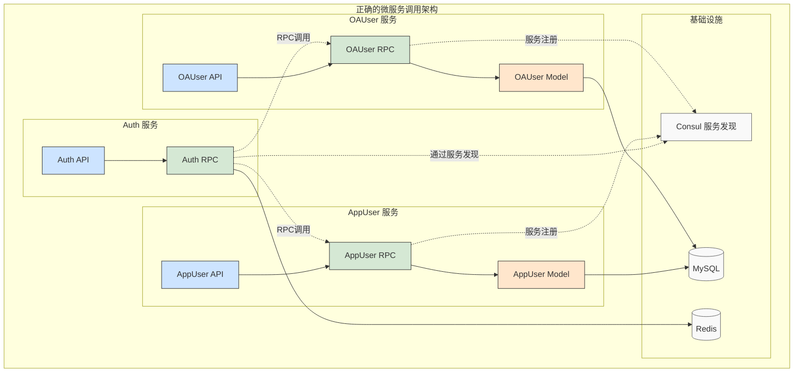

# HuinongFinancial 微服务标准架构指南 (SOP)

> 本文档是惠农金服（HuinongFinancial）项目微服务开发的标准作业程序（SOP）。所有新微服务的创建、开发、配置和部署都应严格遵循本指南。
> 
> **完整实践案例**：`app/appuser` 模块已按照本指南完整实现，包含用户管理、信用评分、风险评估等完整业务功能，以及完整的 Docker 构建和 Kubernetes 部署配置，可作为团队开发的标准参考模板。

## 🚀 重要更新：Go Workspace 依赖管理

**新特性**：我们现在使用 **Go 1.18+ 引入的 Go Workspace 功能** 进行本地模块依赖管理，替代原来的 `replace` 指令方案。

### 主要改进
- ✅ **无需 replace 指令**：告别复杂的伪版本号和路径替换
- ✅ **自动化配置**：代码生成脚本自动创建和管理工作区
- ✅ **IDE 友好**：更好的代码导航和智能提示支持
- ✅ **简化开发**：统一的工作区环境，减少配置错误

### 快速开始
```bash
# 生成代码并自动设置工作区
./scripts/gen-code.sh appuser all

# 或单独设置工作区
./scripts/gen-code.sh appuser workspace
```

> **注意**：本指南已全面更新为 Go Workspace 方案。如果您之前使用 `replace` 指令，建议迁移到新方案以获得更好的开发体验。

## 目录

1. [核心架构：API + RPC 分层模式](#1-核心架构api--rpc-分层模式)
2. [AppUser 模块实践案例](#2-appuser-模块实践案例)
3. [标准开发流程](#3-标准开发流程)
4. [AppUser 模块部署与使用](#4-appuser-模块部署与使用)
5. [微服务依赖管理最佳实践](#5-微服务依赖管理最佳实践)

---

## 1. 核心架构：API + RPC 分层模式

我们采用 `API` + `RPC` 的经典分层架构，将每个微服务（如 `appuser`）在逻辑和物理上拆分为三个独立的 Go 模块。详细代码实践内容请参考 `app/appuser` 目录。

> **实践参考**：`app/appuser` 模块是按照本架构指南完整实现的标准示例，包含完整的用户管理、信用评分、风险评估等业务功能，以及完整的 Docker 构建和 Kubernetes 部署配置。所有新服务都应参考此模块的实现方式。

### 1.1 架构图

```mermaid
graph TD;
    A[用户请求] --> B[API 模块<br/>(HTTP/HTTPS)];
    B --> C{RPC 模块<br/>(gRPC 业务逻辑)};
    C --> D[Model 模块<br/>(数据访问)];
    D -- SQL --> E[(数据库/缓存)];

    subgraph "微服务: appuser"
        direction LR
        subgraph "cmd/api"
            B
        end
        subgraph "cmd/rpc"
            C
        end
        subgraph "cmd/model"
            D
        end
    end

    style B fill:#cde4ff,stroke:#333,stroke-width:2px
    style C fill:#d5e8d4,stroke:#333,stroke-width:2px
    style D fill:#ffe6cc,stroke:#333,stroke-width:2px
```

### 1.2 模块职责与原则

-   **`api` 模块**:
    -   **职责**: 对外 HTTP 流量入口，协议转换层。
    -   **任务**: 定义 API 路由、参数校验、JWT 鉴权、调用下游 RPC。
    -   **原则**: **严禁包含任何业务逻辑，严禁直接访问数据库或缓存。**

-   **`rpc` 模块**:
    -   **职责**: 业务逻辑核心，对内 gRPC 服务提供者。
    -   **任务**: 实现业务逻辑、处理事务、通过 Model 模块访问数据。
    -   **原则**: **只提供纯粹的业务能力接口，不关心上游协议。**

-   **`model` 模块**:
    -   **职责**: 数据访问层 (DAO)。
    -   **任务**: 定义数据表结构、提供 CRUD 方法、处理缓存逻辑。
    -   **原则**: **严禁包含任何业务逻辑，只提供纯粹的数据操作。**

## 2. AppUser 模块实践案例

### 2.1 业务功能概览

`app/appuser` 模块是完整实现的用户管理微服务，包含以下核心功能：

#### **用户认证与管理**
- 用户注册、登录验证
- 密码管理（修改、重置）
- 用户状态管理（正常、冻结、禁用）
- 用户档案信息维护

#### **信用评分系统**
- 多维度信用评分计算
- 评分历史记录追踪
- 自动/手动评分更新
- 信用等级评定

#### **风险评估引擎**
- 贷款/租赁风险评估
- 多因子风险分析
- 评估结果建议
- 历史评估记录

#### **用户认证体系**
- 身份认证（身份证、银行卡）
- 认证状态管理
- 认证数据存储

### 2.2 API 设计亮点

#### **分层权限控制**
```go
// 普通用户 API（JWT 认证）
@server(jwt: Auth)
service appuser {
    get /info returns (DataResp)        // 获取个人信息
    put /profile (UpdateProfileReq)     // 更新个人档案
}

// 公开 API（无需认证）
@server()
service appuser {
    post /register (RegisterReq)        // 用户注册
    get /check-account/:account         // 检查账号可用性
}

// 管理员 API（JWT + 管理员权限）
@server(jwt: Auth, middleware: AdminAuth)
service appuser {
    get /admin/users (GetUsersReq)      // 用户列表管理
    put /admin/users/status             // 用户状态管理
}
```

#### **RESTful 设计规范**
- **资源导向**：`/appuser/profile`、`/appuser/credit-score`
- **HTTP 动词**：GET（查询）、POST（创建）、PUT（更新）
- **统一响应**：`DataResp`、`PageResp`、`CommonResp`
- **路径参数**：`/admin/users/:id`、`/check-account/:account`

#### **类型设计原则**
- **API 层**：只定义 HTTP 特有的请求类型（表单绑定、参数验证）
- **RPC 层**：定义完整的业务数据类型和接口
- **避免重复**：复杂业务类型在 RPC 层统一定义，API 层通过 `interface{}` 返回

### 2.3 数据模型设计

#### **核心表结构**
```sql
-- 用户基础信息表
CREATE TABLE `app_users` (
  `id` bigint unsigned NOT NULL AUTO_INCREMENT,
  `account` varchar(20) NOT NULL COMMENT '账号(手机号)',
  `name` varchar(50) NOT NULL COMMENT '用户姓名',
  `age` int NOT NULL COMMENT '年龄',
  `gender` tinyint NOT NULL DEFAULT '0' COMMENT '性别 0:未知 1:男 2:女',
  `income` decimal(15,2) DEFAULT '0.00' COMMENT '月收入',
  `status` tinyint NOT NULL DEFAULT '1' COMMENT '状态 1:正常 2:冻结 3:禁用',
  PRIMARY KEY (`id`),
  UNIQUE KEY `uk_account` (`account`)
);

-- 用户信用评分表
CREATE TABLE `user_credit_scores` (
  `id` bigint unsigned NOT NULL AUTO_INCREMENT,
  `user_id` bigint unsigned NOT NULL COMMENT '用户ID',
  `real_estate_value` decimal(15,2) DEFAULT '0.00' COMMENT '房产价值',
  `total_score` int NOT NULL DEFAULT '0' COMMENT '总信用评分',
  `credit_level` varchar(20) NOT NULL DEFAULT '' COMMENT '信用等级',
  PRIMARY KEY (`id`),
  UNIQUE KEY `uk_user_id` (`user_id`)
);
```

#### **模型特点**
- **规范化设计**：避免数据冗余，保持数据一致性
- **索引优化**：为查询热点字段建立索引
- **扩展性**：预留字段支持未来业务扩展
- **缓存友好**：通过 go-zero 自动缓存机制提升性能

### 2.4 构建与部署体系

#### **双模式 Docker 构建**
- **本地构建模式**：`api.Dockerfile` / `rpc.Dockerfile` - 极速构建，利用本地 Go 缓存
- **容器构建模式**：`api.build.Dockerfile` / `rpc.build.Dockerfile` - 环境隔离，适合 CI/CD

#### **生产级 Kubernetes 部署**
- **高可用配置**：API 3副本，RPC 2副本
- **自动扩缩容**：HPA 配置，CPU/内存阈值触发
- **健康检查**：就绪探针 + 存活探针
- **资源配置**：精确的 CPU/内存限制

#### **完整 CI/CD 流程**
```bash
# 一键构建、推送、部署
cd app/appuser
./build.sh v1.0.0 deploy

# 支持多种构建模式
BUILD_MODE=local ./build.sh v1.0.0 build    # 本地构建（推荐）
BUILD_MODE=docker ./build.sh v1.0.0 build   # 容器构建
```

### 2.5 API 与 RPC 响应设计原则 (Best Practice)

为了确保前端交互的统一性和内部服务的高效性，我们规定了不同的响应设计策略。

**核心原则：创建(Create)和更新(Update)操作，必须返回其影响的完整资源对象。** 这有利于客户端进行状态更新，并减少不必要的二次查询。

#### **API 层：统一响应模型**

所有 `api` 服务对外暴露的 HTTP 接口，**必须** 使用以下三种标准结构进行响应。这有利于前端统一处理、统一拦截和统一展示。

-   **`CommonResp`**: 用于**真正没有数据体返回**的操作，如 `DELETE`, `Logout`。
    ```go
    type CommonResp {
        Code    int32  `json:"code"`
        Message string `json:"message"`
    }
    ```

> **实践**: 在 `.api` 文件中统一定义这些类型，并在 `service` 中引用它们。对于创建和更新操作，应使用 `DataResp`。

#### **RPC 层：具体、强类型的响应模型**

所有 `rpc` 服务对内提供的 gRPC 接口，**严禁** 使用通用响应结构。每个方法的响应都应是具体、最小化的业务数据结构。

-   **正确示例 (Good)**:
    ```protobuf
    service User {
        rpc GetUser(GetUserReq) returns (GetUserResp);
        // 更新操作也应该返回更新后的资源
        rpc UpdateUser(UpdateUserReq) returns (UserInfo);
    }
    message GetUserResp {
        UserInfo user = 1;
    }
    ```
-   **错误示例 (Bad)**:
    ```protobuf
    // 严禁在 RPC 中使用此类包装
    message RpcDataResp {
        int32 code = 1;
        string message = 2;
        google.protobuf.Any data = 3;
    }
    ```

#### **解耦与协作**

`API` 层和 `RPC` 层通过 `Logic` 层进行解耦。`Logic` 文件的职责就是调用 RPC 获取纯业务数据，然后将其组装成标准的 API 响应结构。

```go
// 在 api/internal/logic/getuserlogic.go 中
func (l *GetUserLogic) GetUser(req *types.GetUserReq) (resp *types.DataResp, err error) {
    // 1. 调用 RPC 获取纯业务数据
    rpcResp, err := l.svcCtx.UserRpc.GetUser(l.ctx, &userclient.GetUserReq{Id: req.Id})
    if err != nil {
        return nil, err // 错误会被框架自动包装
    }

    // 2. 将 RPC 响应组装成标准的 API 响应
    return &types.DataResp{
        Code:    200,
        Message: "success",
        Data:    rpcResp.User, // 将具体的业务数据放入 Data 字段
    }, nil
}
```

### 2.6 特殊规范：关于空消息的处理

**所有`rpc`服务对内提供的 gRPC 接口，当不能使用空响应。**

---

## 3. 标准开发流程

### 步骤一：定义服务

1.  **API 定义**: 在 `app/<service>/<service>-api.api` 文件中定义 HTTP 接口、请求和响应结构。
2.  **RPC 定义**: 在 `app/<service>/<service>-rpc.proto` 文件中定义 gRPC 接口和消息体。
3.  **数据模型定义**: 在 `app/<service>/<service>.sql` 文件中定义数据库表结构。

> **实践示例**：参考 `app/appuser/appuser-api.api`、`app/appuser/appuser-rpc.proto` 和 `app/appuser/appuser.sql` 文件。

### 步骤二：生成代码

使用项目提供的脚本一键生成所有模块的基础代码。
```bash
# 进入项目根目录
./scripts/gen-code.sh appuser all
```

> **实践说明**：appuser 模块已完整生成，包含 117 个文件的完整三层架构代码。

### 步骤三：配置模块依赖 (Go Workspace)

**重要升级**：我们现在使用 Go 1.18+ 引入的 **Go Workspace** 功能，这是比 `replace` 指令更现代、更优雅的本地模块管理方案。

#### **Go Workspace 的优势**
- **无需 replace 指令**：避免伪版本号和复杂的路径替换
- **统一管理**：一个 `go.work` 文件管理所有相关模块
- **IDE 友好**：更好的代码导航和自动补全支持
- **版本控制**：`go.work` 文件通常不提交到版本控制，避免环境差异

#### **自动配置工作区**
代码生成脚本会自动创建和配置 Go Workspace：

```bash
# 生成代码时自动设置工作区
./scripts/gen-code.sh appuser all

# 或单独设置工作区
./scripts/gen-code.sh appuser workspace
```

#### **工作区结构**
生成后的目录结构：
```
app/appuser/cmd/
├── go.work              # 工作区配置文件 (自动生成)
├── api/
│   └── go.mod          # API模块配置
├── rpc/
│   └── go.mod          # RPC模块配置  
└── model/
    └── go.mod          # Model模块配置
```

#### **`go.work` 文件示例**
```go
// app/appuser/cmd/go.work (自动生成)
go 1.24.3

use (
    ./api
    ./rpc
    ./model
)
```

#### **模块配置简化**

-   **`app/appuser/cmd/model/go.mod`** (无变化):
    ```go
    module model

    go 1.24.3

    require github.com/zeromicro/go-zero v1.8.4
    ```

-   **`app/appuser/cmd/rpc/go.mod`** (简化版):
    ```go
    module rpc

    go 1.24.3

    require (
        github.com/zeromicro/go-zero v1.8.4
        github.com/zeromicro/zero-contrib/zrpc/registry/consul v0.0.0-20231030135404-af9ae855016f
        model v0.0.0 // 通过工作区自动解析，无需版本号
    )
    // 无需 replace 指令！
    ```

-   **`app/appuser/cmd/api/go.mod`** (简化版):
    ```go
    module api

    go 1.24.3

    require (
        github.com/zeromicro/go-zero v1.8.4
        github.com/zeromicro/zero-contrib/zrpc/registry/consul v0.0.0-20231030135404-af9ae855016f
        rpc v0.0.0 // 通过工作区自动解析，无需版本号
    )
    // 无需 replace 指令！
    ```

#### **开发工作流**
1. **在工作区根目录操作**：`cd app/appuser/cmd`
2. **构建任意模块**：`go build ./api`、`go build ./rpc`
3. **运行测试**：`go test ./...` (测试所有模块)
4. **依赖管理**：`go work sync` (同步工作区依赖)

### 步骤四：完善服务配置 (`.yaml`)

#### **RPC 服务配置 (`appuserrpc.yaml`)**
> **目标**: 配置一个完整的、可独立运行的业务服务。包含服务监听、服务注册、数据库、缓存等所有必要依赖。

> **实践参考**: `app/appuser/cmd/rpc/etc/appuserrpc.yaml` 文件。端口配置为 20001 依次类推。

```yaml
# app/appuser/cmd/rpc/etc/appuserrpc.yaml
Name: appuserrpc.rpc
ListenOn: 0.0.0.0:20001

# Consul 服务注册配置
# 作用：将本服务注册到 Consul，以便其他服务可以发现并调用。
Consul:
  Host: consul.huinong.internal
  Key: appuserrpc.rpc # 服务在 Consul 中的唯一标识
  Token: "331c00f9-bd87-2383-4394-548a0e66dea9"

# 数据库配置
MySQL:
  DataSource: appuser:appuser@tcp(10.10.10.6:3306)/appuser?charset=utf8mb4&parseTime=true&loc=Asia%2FShanghai

# Redis 缓存配置
# 作用：go-zero model 自动使用 redis 缓存高频查询 (如 FindOne)，提升性能。
CacheConf:
  - Host: 10.10.10.6:6379
    Type: node
    Pass: "ChinaSkills@"

# 日志配置
Log:
  ServiceName: appuserrpc
  Mode: file # 本地开发记入文件，K8s中应使用 console
  Path: logs
  Level: info
  KeepDays: 7
  Compress: true
```

#### **API 服务配置 (`appuser.yaml`)**

> **目标**: 配置一个轻量级的网关层。它只关心 HTTP 协议和下游 RPC 服务的连接，对数据库、缓存等一无所知。

> **实践参考**: `app/appuser/cmd/api/etc/appuser.yaml` 文件。端口配置为 10001 依次类推。

```yaml
# app/appuser/cmd/api/etc/appuser.yaml
Name: appuser-api
Host: 0.0.0.0
Port: 10001

# JWT 认证配置
Auth:
  AccessSecret: "huinong-auth-access-secret"
  AccessExpire: 3600

# RPC 客户端配置 (二选一)
AppUserRpc:
  # 模式一：直连模式 (推荐：开发环境 / API与RPC单容器部署)
  # 理由：本地调用，无网络和服务发现开销，性能最高，调试方便。
  # Endpoints:
  #   - 127.0.0.1:20001
  
  # 模式二：服务发现模式 (推荐：测试 / 生产环境 / K8s 分离部署)
  # 理由：支持 RPC 服务水平扩展、负载均衡和故障转移，是标准的生产级配置。
  # 注意：客户端的服务发现配置使用 Target URL 格式，而不是结构化配置。
  Target: consul://consul.huinong.internal/appuserrpc.rpc

# 日志配置
Log:
  ServiceName: appuser-api
  Mode: file # 本地开发记入文件，K8s中应使用 console
  Path: logs
  Level: info
  KeepDays: 7
  Compress: true
```

### 步骤五：完善代码实现

#### **RPC 服务 (`rpc/` 目录)**

1.  **`internal/config/config.go`**: 确保配置结构体与 `appuserrpc.yaml` 一致。
    ```go
    type Config struct {
        zrpc.RpcServerConf
        Consul consul.Conf
        MySQL  struct {
            DataSource string
        }
        CacheConf cache.CacheConf
    }
    ```
    > **实践参考**: `app/appuser/cmd/rpc/internal/config/config.go`
2.  **`internal/svc/servicecontext.go`**: 初始化所有 `model` 实例。
    ```go
    // RPC 的 servicecontext 需要持有所有数据模型的实例
    type servicecontext struct {
        Config                  config.Config
        AppUsersModel           model.AppUsersModel
        UserCreditScoresModel   model.UserCreditScoresModel
        CreditScoreHistoryModel model.CreditScoreHistoryModel
        RiskAssessmentsModel    model.RiskAssessmentsModel
        UserVerificationsModel  model.UserVerificationsModel
    }

    func Newservicecontext(c config.Config) *servicecontext {
        conn := sqlx.NewMysql(c.MySQL.DataSource)
        return &servicecontext{
            Config:                  c,
            AppUsersModel:           model.NewAppUsersModel(conn, c.CacheConf),
            UserCreditScoresModel:   model.NewUserCreditScoresModel(conn, c.CacheConf),
            CreditScoreHistoryModel: model.NewCreditScoreHistoryModel(conn, c.CacheConf),
            RiskAssessmentsModel:    model.NewRiskAssessmentsModel(conn, c.CacheConf),
            UserVerificationsModel:  model.NewUserVerificationsModel(conn, c.CacheConf),
        }
    }
    ```
    > **实践参考**: `app/appuser/cmd/rpc/internal/svc/servicecontext.go`
3.  **`appuserrpc.go`**: 添加 Consul 服务注册逻辑。
    ```go
    import "github.com/zeromicro/zero-contrib/zrpc/registry/consul"

    // ...
    s := zrpc.MustNewServer(...)
    defer s.Stop()

    // 将本服务注册到 Consul
    if err := consul.RegisterService(c.ListenOn, c.Consul); err != nil {
        log.Fatalf("register consul error: %v", err)
    }

    s.Start()
    ```
    > **实践参考**: `app/appuser/cmd/rpc/appuserrpc.go`

#### **API 服务 (`api/` 目录)**

1.  **`internal/config/config.go`**: 确保配置结构体与 `appuser.yaml` 一致。
    ```go
    type Config struct {
        rest.RestConf
        Auth struct {
            AccessSecret string
            AccessExpire int64
        }
        AppUserRpc zrpc.RpcClientConf
    }
    ```
    > **实践参考**: `app/appuser/cmd/api/internal/config/config.go`
2.  **`internal/svc/servicecontext.go`**: 只初始化下游 RPC 客户端。
    ```go
    // API 的 servicecontext 只持有 RPC 客户端，不关心数据层
    type servicecontext struct {
        Config     config.Config
        AdminAuth  rest.Middleware
        AppUserRpc appuserclient.AppUser
    }

    func Newservicecontext(c config.Config) *servicecontext {
        return &servicecontext{
            Config:     c,
            AdminAuth:  middleware.NewAdminAuthMiddleware().Handle,
            AppUserRpc: appuserclient.NewAppUser(zrpc.MustNewClient(c.AppUserRpc)),
        }
    }
    ```
    > **实践参考**: `app/appuser/cmd/api/internal/svc/servicecontext.go`
3.  **`appuser.go`**: 导入 Consul 包以启用服务发现。
    ```go
    // 匿名导入以触发 init 函数，注册 consul resolver
    import _ "github.com/zeromicro/zero-contrib/zrpc/registry/consul"
    ```
    > **实践参考**: `app/appuser/cmd/api/appuser.go`

### 步骤六：解决依赖与编译

使用 Go Workspace 后，依赖管理变得更加简单。代码生成脚本会自动处理工作区配置。

#### **自动依赖管理**
```bash
# 生成代码时自动设置工作区和依赖 (推荐)
./scripts/gen-code.sh appuser all

# 手动管理工作区和依赖
./scripts/gen-code.sh appuser tidy      # 执行 go mod tidy 后自动设置工作区
./scripts/gen-code.sh appuser workspace # 单独设置工作区

# 批量操作
./scripts/gen-code.sh all tidy          # 为所有服务设置工作区
./scripts/gen-code.sh all workspace     # 为所有服务设置工作区
```

#### **手动工作区操作**
如需手动管理工作区：
```bash
# 进入服务的cmd目录
cd app/appuser/cmd

# 初始化工作区
go work init

# 添加模块
go work use api rpc model

# 同步依赖
go work sync

# 验证工作区
go list -m all
```

#### **常见问题解决**
- **编译错误**：确保在 `cmd` 目录下运行命令
- **依赖问题**：运行 `go work sync` 同步依赖
- **IDE 问题**：重启 IDE 或重新加载工作区

## 3. Kubernetes 部署策略 (最佳实践)

在 Kubernetes 环境中，**强烈推荐将 API 和 RPC 分开打包、分离部署**。为此，我们为每个微服务创建一个 `docker` 目录来存放其 `Dockerfile`。

### 3.1 文件结构调整

```
app/appuser/
├── cmd/
│   ├── api/
│   ├── rpc/
│   └── model/
├── docker/                     <-- 新增
│   ├── api.Dockerfile          <-- 本地构建 (轻量级)
│   ├── rpc.Dockerfile          <-- 本地构建 (轻量级)
│   ├── api.build.Dockerfile    <-- 容器内构建 (CI/CD)
│   ├── rpc.build.Dockerfile    <-- 容器内构建 (CI/CD)
│   └── README.md               <-- Docker 构建指南
├── k8s/                        <-- 新增
│   ├── appuser-deployment.yaml <-- K8s 部署配置
│   └── README.md               <-- K8s 部署指南
├── build.sh                    <-- 新增：一键构建部署脚本
├── appuser-api.api
├── appuser-rpc.proto
└── appuser.sql
```

### 3.2 为什么分离部署？

| 特性 | 分离部署 (推荐) | 合并部署 (不推荐) |
| :--- | :--- | :--- |
| **独立扩展** | ✅ API 和 RPC 可根据负载独立扩展 | ❌ 只能整体扩展，浪费资源 |
| **资源优化** | ✅ 可为 API/RPC 配置不同资源限制 | ❌ 资源配置不精确 |
| **故障隔离** | ✅ API 崩溃不影响 RPC | ❌ 任意一个崩溃导致整个 Pod 失败 |
| **独立发布** | ✅ 可单独更新 API 或 RPC，发布灵活 | ❌ 任何小修改都需要重新构建整个镜像 |

### 3.3 Dockerfile 构建策略 (双模式最佳实践)

> **实践经验**: 为了平衡开发效率和生产环境的一致性，我们采用**双模式构建**策略。

| 构建模式 | Dockerfile | 优点 | 缺点 | 适用场景 |
| :--- | :--- | :--- | :--- | :--- |
| **本地构建** | `api.Dockerfile` | **极速**，利用本地 Go 缓存 | 依赖本地 Go 环境 | **日常开发** |
| **容器构建** | `api.build.Dockerfile` | **环境隔离**，构建可复现 | 较慢，无 Go 缓存 | **CI/CD, 生产** |

---

#### **模式一：本地构建 Dockerfile (开发推荐)**
这种模式的 `Dockerfile` 极度轻量，它假设二进制文件已在本地（或 CI 的上一个阶段）构建好。容器只负责打包和运行。

-   **`app/appuser/docker/api.Dockerfile`**:
    ```dockerfile
    # API 服务 Dockerfile (本地构建版本)
    # 假设二进制文件 'appuser-api' 已在项目根目录构建好
    FROM alpine:latest

    # 安装运行时依赖和设置时区
    RUN apk add --no-cache ca-certificates tzdata \
        && cp /usr/share/zoneinfo/Asia/Shanghai /etc/localtime \
        && echo "Asia/Shanghai" > /etc/timezone \
        && apk del tzdata

    # 创建非 root 用户，提升安全性
    RUN addgroup -g 1000 appuser && \
        adduser -D -s /bin/sh -u 1000 -G appuser appuser

    WORKDIR /app

    # 复制预构建的二进制文件和配置文件
    COPY appuser-api .
    COPY app/appuser/cmd/api/etc ./etc

    # 设置权限
    RUN chmod +x ./appuser-api && \
        chown -R appuser:appuser /app

    USER appuser
    EXPOSE 10001
    CMD ["./appuser-api", "-f", "etc/appuser.yaml"]
    ```
> `rpc.Dockerfile` 与此类似，只需替换相应的文件名。

---

#### **模式二：容器内构建 Dockerfile (CI/CD 推荐)**
这种模式的 `Dockerfile` 包含完整的构建环境，从源码开始编译，保证了构建环境的一致性。

-   **`app/appuser/docker/api.build.Dockerfile`**:
    ```dockerfile
    # API 服务 Dockerfile (容器内构建版本)
    FROM golang:1.24-alpine AS builder

    # 国内环境优化
    ENV GOPROXY=https://goproxy.cn,direct

    WORKDIR /app

    # 1. 复制所有 go.mod/go.sum, 利用依赖缓存
    COPY app/appuser/cmd/model/go.* ./app/appuser/cmd/model/
    COPY app/appuser/cmd/rpc/go.* ./app/appuser/cmd/rpc/
    COPY app/appuser/cmd/api/go.* ./app/appuser/cmd/api/

    # 2. 在 API 模块目录中下载依赖
    WORKDIR /app/app/appuser/cmd/api
    RUN go mod tidy

    # 3. 复制服务源码
    WORKDIR /app
    COPY app/appuser/ ./app/appuser/

    # 4. 构建二进制文件
    WORKDIR /app/app/appuser/cmd/api
    RUN CGO_ENABLED=0 GOOS=linux go build -o /app/appuser-api .

    # --- 运行阶段 ---
    FROM alpine:latest
    WORKDIR /app
    COPY --from=builder /app/appuser-api .
    COPY app/appuser/cmd/api/etc /app/etc
    EXPOSE 10001
    CMD ["./appuser-api", "-f", "etc/appuser.yaml"]
    ```

### 3.4 Kubernetes YAML 模板
> 位于 `app/appuser/k8s/appuser-deployment.yaml`

该文件定义了独立的 `Deployment`、`Service` 和 `ConfigMap` for API 和 RPC，并通过 `Ingress` 对外暴露 API 服务。这是生产环境的标准化部署配置。

### 3.5 自动化构建脚本
> 位于 `app/appuser/build.sh`

该脚本实现了自动化构建 Docker 镜像、推送到镜像仓库以及部署到 Kubernetes 的完整 CI/CD 流程。

- **`app/appuser/build.sh` 示例**:
  ```bash
  #!/bin/bash
  set -e

  # 服务名称、镜像仓库、版本号
  SERVICE_NAME="appuser"
  REGISTRY="registry.huinong.internal/huinong"
  VERSION=${1:-"latest"}
  
  # 构建模式: local(默认) 或 docker
  BUILD_MODE=${BUILD_MODE:-"local"}

  # --- Helper Functions ---
  log_step() { echo -e "\n\e[34m>>> $1\e[0m"; }
  log_info() { echo "    $1"; }

  # --- Build Logic ---
  
  # 1. 本地构建二进制文件 (仅在 local 模式下)
  build_binaries() {
      log_step "Building binaries locally for $SERVICE_NAME..."
      export CGO_ENABLED=0 GOOS=linux GOARCH=amd64

      log_info "Building API binary..."
      (cd app/$SERVICE_NAME/cmd/api && go build -ldflags="-s -w" -o ../../../../$SERVICE_NAME-api .)

      log_info "Building RPC binary..."
      (cd app/$SERVICE_NAME/cmd/rpc && go build -ldflags="-s -w" -o ../../../../$SERVICE_NAME-rpc .)
      
      log_info "Binaries created in project root."
  }

  # 2. 构建 Docker 镜像
  build_images() {
      log_step "Building Docker images for $SERVICE_NAME:$VERSION (Mode: $BUILD_MODE)"

      if [ "$BUILD_MODE" = "local" ]; then
          build_binaries
          log_info "Building images with local binaries..."
          docker build -f ./app/$SERVICE_NAME/docker/api.Dockerfile -t $REGISTRY/$SERVICE_NAME-api:$VERSION .
          docker build -f ./app/$SERVICE_NAME/docker/rpc.Dockerfile -t $REGISTRY/$SERVICE_NAME-rpc:$VERSION .
          
          log_info "Cleaning up local binaries..."
          rm -f $SERVICE_NAME-api $SERVICE_NAME-rpc
      else
          log_info "Building images using in-container build..."
          docker build -f ./app/$SERVICE_NAME/docker/api.build.Dockerfile -t $REGISTRY/$SERVICE_NAME-api:$VERSION .
          docker build -f ./app/$SERVICE_NAME/docker/rpc.build.Dockerfile -t $REGISTRY/$SERVICE_NAME-rpc:$VERSION .
      fi
      
      log_info "Docker images built successfully!"
  }

  # --- Main Execution ---
  
  build_images
  # 在此添加 push 和 deploy 逻辑
  
  echo -e "\n\e[32m>>> Build completed for $SERVICE_NAME:$VERSION\e[0m"
  ```
  > **使用方法**:  
  > `BUILD_MODE=local ./build.sh v1.0.0` (本地构建)  
  > `BUILD_MODE=docker ./build.sh v1.0.0` (容器构建)

> **注意**：构建命令 `docker build` 的上下文 (`.`) 是项目根目录，而不是 `app/appuser` 目录。

---

## 4. AppUser 模块部署与使用

### 4.1 快速启动

#### **本地开发环境**
```bash
# 1. 启动 RPC 服务
cd app/appuser/cmd/rpc
go run appuserrpc.go -f etc/appuserrpc.yaml

# 2. 启动 API 服务  
cd app/appuser/cmd/api
go run appuser.go -f etc/appuser.yaml
```

#### **生产环境部署**
```bash
# 使用 Docker 容器化部署
cd app/appuser
./build.sh v1.0.0 deploy

# 或分步执行
./build.sh v1.0.0 build    # 构建镜像
./build.sh v1.0.0 push     # 推送镜像
./build.sh v1.0.0 deploy   # 部署到 K8s
```

### 4.2 API 使用示例

#### **用户注册**
```bash
curl -X POST http://localhost:10001/api/v1/appuser/register \
  -H "Content-Type: application/json" \
  -d '{
    "account": "13800138000",
    "password": "123456",
    "name": "张三",
    "age": 25,
    "gender": 1
  }'
```

#### **获取用户信息**（需要 JWT）
```bash
curl -X GET http://localhost:10001/api/v1/appuser/info \
  -H "Authorization: Bearer <jwt_token>"
```

#### **信用评分计算**
```bash
curl -X POST http://localhost:10001/api/v1/appuser/credit-score/calculate \
  -H "Authorization: Bearer <jwt_token>"
```

#### **风险评估**
```bash
curl -X POST http://localhost:10001/api/v1/appuser/assess-risk \
  -H "Authorization: Bearer <jwt_token>" \
  -H "Content-Type: application/json" \
  -d '{
    "application_type": "loan",
    "amount": 100000,
    "duration": 12,
    "purpose": "购车"
  }'
```

### 4.3 服务监控

#### **健康检查**
- **API 服务**: `http://localhost:10001/ping`
- **RPC 服务**: 通过 Consul 健康检查
- **数据库连接**: 通过应用日志监控

#### **关键指标**
- **QPS**: API 请求量统计
- **响应时间**: P95、P99 延迟监控  
- **错误率**: HTTP 4xx/5xx 错误统计
- **数据库性能**: 慢查询监控

### 4.4 扩展指南

#### **添加新接口**
1. 在 `appuser-api.api` 中定义 HTTP 接口
2. 在 `appuser-rpc.proto` 中定义 RPC 方法
3. 运行 `./scripts/gen-code.sh appuser api` 重新生成代码
4. 实现 Logic 层业务逻辑

#### **添加新数据表**
1. 在 `appuser.sql` 中添加表结构
2. 运行 `./scripts/gen-code.sh appuser model` 生成 Model 代码
3. 在 `servicecontext.go` 中注册新的 Model

#### **性能优化**
- **缓存策略**: go-zero 自动缓存 + Redis 手动缓存
- **数据库优化**: 索引优化、查询优化、读写分离
- **服务拆分**: 按业务域进一步拆分微服务

---

## 5. 微服务依赖管理最佳实践

> **重要提醒**：本章节总结了在实际开发中容易犯的错误和正确的架构实践，是血泪教训的总结，必须严格遵循。

### 5.1 服务调用的黄金法则

#### ❌ 错误实践：代码层面的直接依赖

**错误示例**：
```go
// ❌ 错误：Auth RPC 直接依赖其他服务的代码模块
// app/auth/cmd/rpc/go.mod
require (
    appuser-rpc v0.0.0-00010101000000-000000000000  // ❌ 错误
    oauser-rpc v0.0.0-00010101000000-000000000000   // ❌ 错误
)
replace appuser-rpc => ../../appuser/cmd/rpc        // ❌ 错误
replace oauser-rpc => ../../oauser/cmd/rpc          // ❌ 错误
```

**问题分析**：
- 这样做会造成服务间的强耦合
- 部署时必须同时部署所有相关服务
- 无法实现独立扩展和故障隔离
- 违背了微服务的基本原则

#### ✅ 正确实践：通过服务发现的松耦合调用

**正确示例**：
```go
// ✅ 正确：Auth RPC 通过服务发现调用其他服务
// app/auth/cmd/rpc/go.mod
require (
    github.com/zeromicro/go-zero v1.8.4
    github.com/zeromicro/zero-contrib/zrpc/registry/consul v0.0.0-20231030135404-af9ae855016f
    // 不直接依赖其他服务的代码
)
```

```yaml
# ✅ 正确：通过配置文件指定服务发现
# app/auth/cmd/rpc/etc/authrpc.yaml
AppUserRpc:
  Target: consul://consul.huinong.internal/appuserrpc.rpc
OaUserRpc:
  Target: consul://consul.huinong.internal/oauserrpc.rpc
```

### 5.2 API 层调用原则

#### ❌ 错误实践：API 跨服务调用

```go
// ❌ 错误：Auth API 直接调用其他服务的 RPC
type ServiceContext struct {
    Config     config.Config
    AuthRpc    authclient.Auth      // ✅ 正确：调用自己的 RPC
    AppUserRpc appuserclient.AppUser // ❌ 错误：跨服务调用
    OaUserRpc  oauserclient.OaUser   // ❌ 错误：跨服务调用
}
```

#### ✅ 正确实践：API 只调用自己的 RPC

```go
// ✅ 正确：Auth API 只调用自己的 RPC
type ServiceContext struct {
    Config  config.Config
    AuthRpc authclient.Auth  // ✅ 只调用自己的 RPC
}
```

**调用流程**：
```
1. 客户端请求 → Auth API
2. Auth API → Auth RPC (自己的服务)
3. Auth RPC → 通过服务发现 → AppUser RPC (验证用户)
4. Auth RPC → 通过服务发现 → OAUser RPC (验证管理员)
```

### 5.3 Go Workspace 依赖配置标准 (新方案)

**重要升级**：我们现在使用 **Go Workspace** 替代 `replace` 指令进行本地模块管理。

#### 5.3.1 工作区配置

```go
// app/*/cmd/go.work - 工作区配置文件 (自动生成)
go 1.24.3

use (
    ./api
    ./rpc  
    ./model
)

// 注意：
// 1. go.work 文件位于 app/*/cmd/ 目录下
// 2. 自动包含当前服务的所有模块
// 3. 通常不提交到版本控制 (.gitignore)
```

#### 5.3.2 Model 模块依赖 (无变化)

```go
// app/*/cmd/model/go.mod - 数据访问层，无需依赖其他业务模块
module model

go 1.24.3

require github.com/zeromicro/go-zero v1.8.4
// 无其他业务模块依赖
```

#### 5.3.3 RPC 模块依赖 (简化版)

```go
// app/*/cmd/rpc/go.mod - 业务逻辑层，通过工作区依赖 model
module rpc

go 1.24.3

require (
    github.com/zeromicro/go-zero v1.8.4
    github.com/zeromicro/zero-contrib/zrpc/registry/consul v0.0.0-20231030135404-af9ae855016f
    google.golang.org/grpc v1.73.0
    google.golang.org/protobuf v1.36.6
    model v0.0.0  // ✅ 通过工作区自动解析，无需伪版本号
)

// ✅ 无需 replace 指令！工作区自动处理本地依赖
```

#### 5.3.4 API 模块依赖 (简化版)

```go
// app/*/cmd/api/go.mod - 协议转换层，通过工作区依赖 rpc
module api

go 1.24.3

require (
    github.com/zeromicro/go-zero v1.8.4
    github.com/zeromicro/zero-contrib/zrpc/registry/consul v0.0.0-20231030135404-af9ae855016f
    rpc v0.0.0  // ✅ 通过工作区自动解析，无需伪版本号
)

// ✅ 无需 replace 指令！工作区自动处理本地依赖
```

#### 5.3.5 工作区管理命令

```bash
# 自动设置工作区 (推荐)
./scripts/gen-code.sh appuser workspace

# 手动工作区操作
cd app/appuser/cmd
go work init              # 初始化工作区
go work use api rpc model # 添加模块
go work sync              # 同步依赖
go list -m all            # 查看所有模块

# 构建和测试
go build ./api            # 构建API模块
go build ./rpc            # 构建RPC模块
go test ./...             # 测试所有模块
```

### 5.4 服务间通信架构图



### 5.5 常见错误汇总

#### 错误1：循环依赖
```bash
# ❌ 错误现象
package model is not in std (/root/sdk/go1.24.3/src/model)
package rpc/oauserclient is not in std (/root/sdk/go1.24.3/src/rpc/oauserclient)
```

**原因**：缺少 `replace` 指令或路径配置错误

**解决方案**：
```bash
# 运行脚本修复所有依赖
./scripts/gen-code.sh all tidy
```

#### 错误2：服务强耦合
- **现象**：一个服务无法独立启动
- **原因**：在 go.mod 中直接依赖其他服务代码
- **解决**：移除代码依赖，改用服务发现

#### 错误3：违背单一职责
- **现象**：API 直接调用多个 RPC 服务
- **原因**：没有遵循"API 只调用自己 RPC"的原则  
- **解决**：将跨服务调用逻辑下沉到 RPC 层

### 5.6 依赖管理检查清单 (Go Workspace版)

在完成服务开发后，请检查以下项目：

- [ ] **工作区配置**：`go.work` 文件已正确生成并包含所有模块
- [ ] **API 模块**：只依赖自己的 RPC，无 `replace` 指令
- [ ] **RPC 模块**：只依赖自己的 Model，通过服务发现调用其他 RPC
- [ ] **Model 模块**：只依赖 go-zero 框架，无其他业务依赖
- [ ] **配置文件**：RPC 客户端使用 Consul 服务发现地址
- [ ] **编译测试**：在 `cmd` 目录下 `go run ./api/xxx.go --help` 能正常运行
- [ ] **工作区测试**：`go work sync` 和 `go list -m all` 正常执行
- [ ] **架构原则**：遵循单一职责，服务边界清晰

### 5.7 故障排查指南 (Go Workspace版)

#### 问题：编译错误 "package xxx is not in std"
1. **检查工作区**：确保在 `cmd` 目录下且存在 `go.work` 文件
2. **重新设置工作区**：运行 `./scripts/gen-code.sh servicename workspace`
3. **手动同步依赖**：`cd app/servicename/cmd && go work sync`
4. **检查模块路径**：确保 go.mod 中的模块依赖名称正确

#### 问题：工作区相关错误
1. **初始化工作区**：`go work init` 然后 `go work use api rpc model`
2. **同步依赖**：`go work sync` 解决版本冲突
3. **验证工作区**：`go list -m all` 查看所有模块状态
4. **重置工作区**：删除 `go.work` 文件后重新生成

#### 问题：IDE 无法识别工作区
1. **重启IDE**：重新加载工作区配置
2. **打开正确目录**：在 IDE 中打开 `app/servicename/cmd` 目录
3. **Go版本**：确保使用 Go 1.18+ 以支持工作区功能

#### 问题：服务启动时找不到其他服务
1. 检查 Consul 是否正常运行
2. 检查被调用服务是否已注册到 Consul
3. 检查服务发现配置是否正确

#### 问题：RPC 调用失败
1. 检查网络连通性
2. 检查服务注册的 Key 是否一致
3. 检查 Consul Token 配置

---

**遵循本指南，可以确保团队所有成员以统一、高效、可靠的方式开发和交付微服务。特别是第5章的依赖管理实践，是避免架构陷阱的重要保障。**
